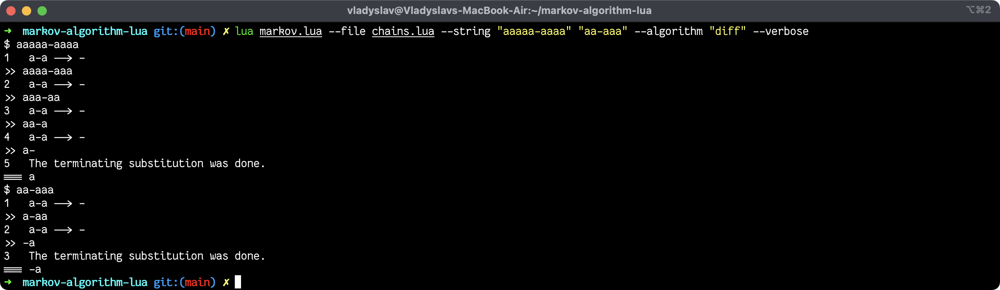

# markov-algorithms-lua
[Lua][lua]-Data-Described [Markov Algorithms][malorithms] executer.

### Features
- [x] Easy to use
- [x] Has verbose terminal options 
- [x] Markov Algorithm itsef described as Lua table ([BibTex][bibtex]-like syntax)

## Screenshots




## Algorithms notation

```lua
malgorithm{ -- doubles string "aaa" to "aaaaaa"
	name = "double",
	{["*a"] = "aa*"},
	{["*"] = "", terminating = true},
	{["a"] = "*a"}
}

malgorithm{ -- takes "aaa-aa" and returns "a" (unary)
	name = "diff",
	{["a-a"] = "-"},
	{["a-"] = "a", terminating = true},
	{["-a"] = "-a", terminating = true}
}

malgorithm{ -- converts "0101" to "aaaaa" (binary to unary conversion)
	name = "toun",
	{["1"] = "0a"},
	{["a0"] = "0aa"},
	{["0"] = ""}
}

malgorithm{ -- takes "aaa*aa" and returns "aaaaaa" (unary multiplication)
	name = "mult",
	{["Ba"] = "aB"},
	{["Aa"] = "aBA"},
	{["A"]  = ""},
	{["a*"] = "*A"},
	{["*a"] = "*"},
	{["*"] = ""},
	{["B"] = "a"},
}

malgorithm{ -- takes "aaaa|aa" and returns gcd(aaaa, aa) (unary gcd)
	name = "gcd",
	{["aA"] = "Aa"},
	{["a|a"] = "A|"},
	{["a|"] = "|B"},
	{["B"] = "a"},
	{["A"] = "C"},
	{["C"] = "a"},
	{["|"] = ""}
}

malgorithm{ -- takes "aaaaa/aa" and returns "aaRa" (unary division with remainder)
	name = "div",
	{["*A"] = "Pc*"}, -- 4
	{["cP"] = "Pc"}, -- 5

	{["*"] = ""}, -- 6

	{["cc"] = "c"}, -- 7
	{["c"] = "x"}, -- 8

	{["P"] = "a"}, -- 9

	{["Aa"] = "aA"}, -- 2
	{["a/a"] = "/A"}, -- 1

	{["/aA"] = "/ar"}, -- 10 
	{["rA"] = "Ar"}, -- 11
	{["/a"] = "/"}, -- 12

	{["A"] = "*A"}, -- 3

	{["rx"] = "xr"}, -- 13
	{["xr"] = "xRr"}, -- 14
	{["/r"] = "Rr"}, -- 15

	{["/"] = ""}, --16

	{["r"] = "a"}, -- 17
	{["x"] = "a"}, -- 18
}

```
You can get more Lua-described Markov algorithms examples in [`sorting.lua`][sorting] and [`chains.lua`][chains].

---
To make Your Markov algorithm to be able to run in this program You need
* Create new `.lua` file or edit existing [`sorting.lua`][sorting] or [`chains.lua`][chains]
* Make [Lua table][luatable] and fill its fields with:
    - `name` field. This is used to adress You Markov algorithm with `-a` option
    - Other tables in format `{["string"] = "replacement"}`
        - `terminating` field set to `true`. This is not necessary if Your algorithm designed to have no possible substitutions at the end. If so, then program ends. Also, this means that you can't have `{["terminating"] = "replacement"}`.
* Pass this table to `malgorithm` function. 
* Execute `markov.lua` with options `-f file.lua -a algorithm_name` at least.
* Volia!

## How to install
Application relies on
- [x] [`Lua v5.3`][lua] and newer
- [x] [`argparse v0.7.1`][argparse] and newer
- [ ] [`luarocks`][luarocks] (optional)

Example installation with [`homebrew`][brew]:
```shell-session
$ brew install lua luarocks
$ luarocks install argparse
```

Then, app can be run with

```
$ lua markov.lua <options>
```

 Try 

 ```
 $ lua markov.lua --help
 ```

 to get movin on.


## Contributing
If You have any problems running markov-algorithms-lua, You are welcome at the [issues tab][issue].


[issue]: https://github.com/Dolfost/markov-algorithm-lua/issues
[malorithms]: https://en.wikipedia.org/wiki/Markov_algorithm

[sorting]:https://github.com/Dolfost/markov-algorithm-lua/blob/main/sorting.lua
[chains]: https://github.com/Dolfost/markov-algorithm-lua/blob/main/chains.lua

[lua]: https://www.lua.org
[argparse]: https://luarocks.org/modules/argparse/argparse
[luarocks]: https://luarocks.org

[bibtex]: https://en.wikipedia.org/wiki/BibTeX
[brew]: https://brew.sh
[luatable]: https://www.lua.org/pil/2.5.html
